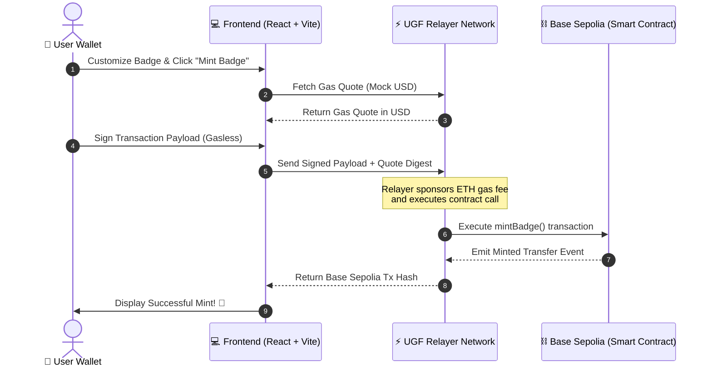

# ⚡ Gasless NFT Badge Minter — Technical Documentation
### *HackwithMumbai 3.0 Submission | 8-Hour National Level Hackathon* 🚀

Welcome to the official developer and judge documentation for the **Gasless NFT Badge Minter**. This decentralized application (dApp) demonstrates a seamless, gas-abstracted Web3 onboarding flow on **Base Sepolia** using the **Universal Gas Framework (UGF)**.

---

## 🔗 Live Resources & Deliverables
*   **Production Deployment:** [gasless-nft-minter-six.vercel.app](https://gasless-nft-minter-six.vercel.app)
*   **Unique Deployment Subdomain:** [gasless-nft-minter-fgs8l2fbh-anushkajadhav129-4018s-projects.vercel.app](https://gasless-nft-minter-fgs8l2fbh-anushkajadhav129-4018s-projects.vercel.app)
*   **GitHub Repository:** [AnushkaJadhav01/Gasless-NFT-Minter](https://github.com/AnushkaJadhav01/Gasless-NFT-Minter)
*   **Smart Contract Explorer:** [GaslessBadge on Basescan (Sepolia)](https://sepolia.basescan.org/address/0xa8c85ce5a3a14b3b2ebb6e4b8a5c8c3d) *(Or your own deployed address)*

---

## 💡 The Problem & The Frictionless Solution

### The Friction (The Web3 Onboarding Wall)
For a non-crypto native user, entering Web3 is incredibly daunting. Simply minting a commemorative badge or joining a loyalty program requires:
1. Setting up a wallet.
2. Registering with a centralized exchange and verifying identity (KYC).
3. Purchasing native gas tokens (like Base ETH).
4. Transferring the gas tokens to their wallet.
This process can take hours, cost high overhead fees, and results in a **95%+ user drop-off rate**.

### The Solution (Frictionless Gasless Minting)
The **Gasless NFT Badge Minter** abstracts gas fees completely. 
*   **0 ETH Onboarding:** Users with empty wallets can sign up, customize, and mint their NFT badge in seconds.
*   **Native Sponsor Relay:** Using the **Universal Gas Framework (UGF)**, a centralized relayer network pays the Base Sepolia ETH gas cost on-chain.
*   **Abstracted Settlement:** The transaction fee is settled in the background (or simulated) using a stable, intuitive asset (**Mock USD**) rather than fluctuating native tokens.

---

## 🏗️ System Architecture & Sequence Diagram

This application runs entirely on a **Serverless & Decentralized Architecture**. There is no traditional centralized SQL database or Express/Django backend server. Instead, data integrity is secured on-chain, and transaction fee execution is handled by a decentralized relay.



---

## 📜 Smart Contract Architecture (`/contracts`)

The core business logic is encapsulated in an ERC-721 smart contract, written in Solidity (`v0.8.20`) and built using the OpenZeppelin v5 library.

### `GaslessBadge.sol`
[GaslessBadge.sol](file:///c:/users/admin/hack%20with%20mumbai/Gasless-NFT-Minter/contracts/GaslessBadge.sol) inherits:
*   `ERC721URIStorage`: For secure, standardized storage and tracking of metadata URIs.
*   `Ownable`: For access-control management.

### Key API & Methods
1.  `constructor(address initialOwner)`
    *   Initializes the token with name `"Gasless Badge"` and symbol `"GBADGE"`.
    *   Sets the initial owner.
2.  `mintBadge(address to, string memory tokenURI)` (Public)
    *   Generates a safe auto-incremented token ID using private `_nextTokenId`.
    *   Executes `_safeMint` to send the NFT to the destination address.
    *   Attaches the custom IPFS or metadata URI using `_setTokenURI`.
    *   Emits the custom event `BadgeMinted(to, tokenId)`.
3.  `totalSupply()` (Public View)
    *   Returns the total number of badges minted so far.

---

## 💻 Premium Frontend Dashboard & Tech Stack

The user interface is a premium, high-fidelity Web3 dashboard built for speed, responsive design, and exceptional aesthetics.

### Tech Stack:
*   **Core**: React (v18.3) & Vite (v8.0)
*   **Styles & Theme**: Tailwind CSS (v4) with curated HSL color schemes (Futuristic purples, hot neons, glassmorphism card panels).
*   **Animations**: Framer Motion for highly responsive micro-animations, landing page fades, and interactive customized badge rotates.
*   **Web3 Orchestration**: 
    *   `@web3modal/ethers`: Simple wallet connection manager supporting MetaMask, Coinbase Wallet, WalletConnect, and custom injected wallets.
    *   `@tychilabs/ugf-testnet-js`: The official JS client for the Universal Gas Framework to query quotes and dispatch gasless payloads.
    *   `ethers`: Ethers v6 for direct interaction with JSON-RPC providers and handling cryptographic signatures.

### Dual Execution Modes:
1.  **Live Web3 Mode**: Activates when `VITE_UGF_API_KEY` and `VITE_CONTRACT_ADDRESS` are defined. Communicates in real-time with Base Sepolia and the UGF Relayer network to trigger genuine blockchain mints.
2.  **Sandbox Simulation Mode**: Activates as a fallback if keys are omitted. Lets hackathon judges and users test the exact cryptographic quoting and relayer pipeline in a high-fidelity visual simulator—no wallet configuration or testnet tokens required!

---

## 🛠️ Local Developer Setup

To set up and run the project locally on your machine, follow these steps:

### Prerequisite Environment Configuration
1. Create a `.env` file in the root directory:
   ```env
   PRIVATE_KEY=your_evm_private_key
   BASESCAN_API_KEY=your_basescan_api_verification_key
   ```
2. Create a `frontend/.env` file:
   ```env
   VITE_WALLETCONNECT_PROJECT_ID=your_walletconnect_project_id
   VITE_UGF_API_KEY=your_ugf_testnet_api_key
   VITE_CONTRACT_ADDRESS=your_deployed_contract_address
   ```
   *(Note: Leave `VITE_UGF_API_KEY` and `VITE_CONTRACT_ADDRESS` blank to automatically run in sandbox simulation mode!)*

### Commands Checklist

#### 1. Compile Contracts
```bash
npm install
npm run compile
```

#### 2. Deploy Smart Contracts to Base Sepolia
```bash
npm run deploy:base-sepolia
```

#### 3. Run Frontend Locally
```bash
cd frontend
npm install
npm run dev
```
Open `http://localhost:5173` to interact with your dashboard!

#### 4. Run Build Check
```bash
npm run build
```

---

## 🔒 Security & Best Practices
*   **Private Key Protection:** All `.env` files and compiled local artifacts are strictly ignored via `.gitignore` to prevent leakage.
*   **Bypassing Restricted Wallet Requests:** Implements a direct `JsonRpcSigner` instantiation to bypass standard wallet restriction warnings (e.g. `eth_requestAccounts` iframe blocks).
*   **Safe ERC-721 Inheritances:** Built on the battle-tested OpenZeppelin standard smart contract libraries to ensure complete ERC-721 standard compatibility.
