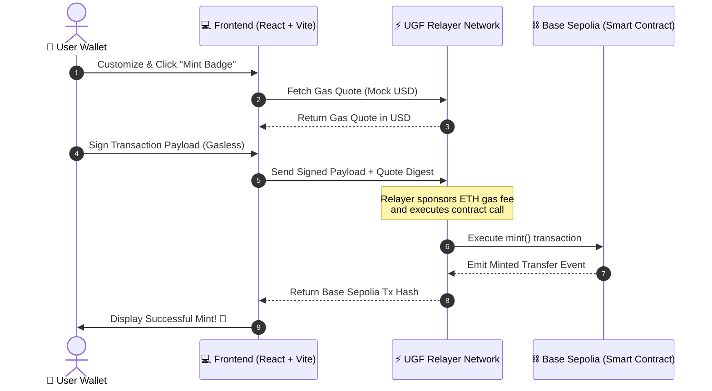

# ⚡ Gasless NFT Badge Minter

A premium, futuristic Web3 dApp demonstrating how to mint customizable NFT badges on the **Base Sepolia** testnet *without* requiring any native ETH for gas. 

Gas is completely abstracted away using the **Universal Gas Framework (UGF)**, allowing users to pay (or simulate paying) transaction fees seamlessly using **Mock USD**.

---

## 🏗️ Architecture Design (Why There Is No Centralized Backend)

Unlike traditional web applications, this dApp follows a **Serverless & Decentralized Web3 Architecture**. It does not utilize or require a centralized server (like Express, Go, or Django). 

Instead, the "backend" is split between **On-Chain Logic** and **Decentralized Relay Services**:



### The Two Components of our Backend:
1. **On-Chain Smart Contracts (`/contracts`):** Written in Solidity and deployed to **Base Sepolia**. The contracts represent our tamper-proof, decentralized database and business logic layer.
2. **Universal Gas Relayer (`@tychilabs/ugf-testnet-js`):** An execution relayer layer that intercepts contract execution requests, sponsors the native gas cost (ETH), and settles the cost by deducting **Mock USD** from the user's balance.

---

## ✨ Features

*   **Zero-ETH Minting:** Users can connect a brand-new wallet with exactly `0 ETH` and still mint their custom badges successfully.
*   **Dynamic Visual Customizer:** Real-time visual customizer to adjust badge initials, themes (Neon Glows, Cosmic Purples, etc.), cores (Zap, Star, Gem), and glow intensities before minting.
*   **Polished Dark Mode UI:** Premium Web3 dashboard designed with smooth preloader animations, Glassmorphism, and responsive CSS/Tailwind transitions.
*   **Dual Mode Execution:**
    *   **Live Mode:** Connects to the Base Sepolia Testnet using `@web3modal/ethers` and the `@tychilabs/ugf-testnet-js` client.
    *   **Sandbox / Mock Mode:** Allows instant playground simulation of the gasless UGF transaction flow with full visual loaders—no environment keys needed.

---

## 📁 Folder Structure

```
gasless-nft-minter/
├── contracts/          # Solidity Smart Contracts (ERC721 Badge Contract)
│   └── GaslessBadge.sol
├── scripts/            # Deployment & automation scripts
│   └── deploy.js
├── frontend/           # React + Vite Frontend App
│   ├── src/
│   │   ├── components/ # Reusable UI components (Transaction status, docs, etc.)
│   │   ├── pages/      # Application page layouts (Landing & Dashboard)
│   │   ├── utils/      # UGF fallback client mocks
│   │   ├── App.jsx     # Core Web3Modal config & transaction coordinator
│   │   └── index.css   # Tailored utility classes & animations
│   ├── .env.example    # Frontend environment config
│   └── package.json
├── hardhat.config.js   # Hardhat development and deployment configuration
├── package.json        # Root package manifest (Smart contract tooling)
└── README.md           # Documentation
```

---

## 🚀 Getting Started

### 1. Smart Contract Deployment (Optional)

If you wish to compile or deploy the Solidity contract yourself:

1.  **Install Root Dependencies:**
    ```bash
    npm install
    ```
2.  **Configure Environment Variables:**
    Create a `.env` file in the root directory based on `.env.example`:
    ```env
    PRIVATE_KEY=your_wallet_private_key
    BASESCAN_API_KEY=your_basescan_verification_key
    ```
3.  **Compile & Deploy to Base Sepolia:**
    ```bash
    npm run compile
    ```
    ```bash
    npm run deploy:base-sepolia
    ```
4.  Copy the deployed contract address from the terminal output.

---

### 2. Frontend Development & Run

1.  **Navigate to the Frontend Directory:**
    ```bash
    cd frontend
    ```
2.  **Install Frontend Dependencies:**
    ```bash
    npm install
    ```
3.  **Configure Environment Variables:**
    Create a `frontend/.env` file:
    ```env
    VITE_WALLETCONNECT_PROJECT_ID=your_walletconnect_project_id
    VITE_UGF_API_KEY=your_ugf_testnet_api_key
    VITE_CONTRACT_ADDRESS=your_deployed_contract_address
    ```
    > [!TIP]
    > **No API Keys? No Problem!** Leave `VITE_UGF_API_KEY` and `VITE_CONTRACT_ADDRESS` blank or undefined to automatically boot the frontend in **Sandbox Mock Mode**. This runs a realistic simulation of the gasless quoting and UGF relay cycle!

4.  **Launch the Dev Server:**
    ```bash
    npm run dev
    ```
5.  Open `http://localhost:5173` in your browser.

---

## ⚡ How the UGF Gasless Relay Works

1.  **Gas Quoting:** The client application requests a transaction quote from the UGF Relayer API.
    ```javascript
    const quote = await ugfClient.quote.get({
      payment_coin: TYI_USD_PAYMENT_COIN,
      payer_address: wallet.address,
      tx_object: mintTxData,
      dest_chain_id: BASE_SEPOLIA_CHAIN_ID
    });
    ```
2.  **Sponsorship & Execution:** The transaction payload along with the quote digest is signed and sent to the UGF Relayer. The Relayer pays the native ETH gas cost to execute the minting logic on the contract on Base Sepolia.
    ```javascript
    const result = await ugfClient.chains.evm.sponsorAndExecute(
      quote.digest,
      activeSigner,
      async (signer) => {
        return {
          to: contractAddress,
          data: mintTxData
        };
      }
    );
    ```

---

## 🔒 Security & Best Practices

> [!WARNING]
> Never commit your private keys or `.env` files to git. The `.gitignore` file is pre-configured to ignore all `.env` files.
